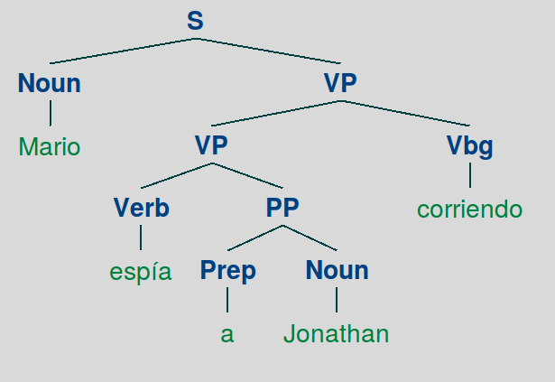
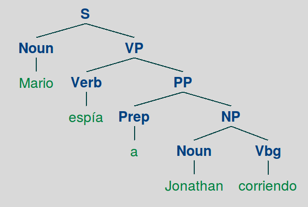

TRABAJO PRÁCTICO 3: ANÁLISIS SINTÁCTICO
=======================================

Ejercicio 1: Evaluación de Parsers
----------------------------------

### FLAT

|  | Precision | Recall | F1 |
| :---: | :---: | :---: | :---: |
| Labeled | 99.93% | 14.58% | 25.44% |
| Unlabeled | 100.00% | 14.59% | 25.46% |

> Tiempo de evaluación: 0 min 7.6 seg

### RBRANCH

|  | Precision | Recall | F1 |
| :---: | :---: | :---: | :---: |
| **Labeled** | 8.81% | 14.58% | 10.98% |
| **Unlabeled** | 8.88% | 14.69% | 11.07% |

> Tiempo de evaluación: 0 min 8.6 seg

### LBRANCH

|  | Precision | Recall | F1 |
| :---: | :---: | :---: | :---: |
| **Labeled** | 8.81% | 14.58% | 10.98% |
| **Unlabeled** | 14.71% | 24.35% | 18.34% |

> Tiempo de evaluación: 0 min 8.5 seg

Ejercicio 2: Algoritmo CKY
--------------------------

> En el ejemplo de ambigüedad la oración que utilizaremos será
> "Mario espía a Jonathan corriendo".
> No queda claro si el que está corriendo es Mario o Jonathan.
> El test que chequea esto, está en *test_ambiguo.py*

> Los árboles posibles son:

> Pero ya como la gramática es:

| GRAMÁTICA |
| :-: |
| S -> Noun VP  [1.0] |
| VP -> VP Vbg  [0.7] |
| VP -> Verb PP  [0.3] |
| PP -> Prep Noun [0.8] |
| PP -> Prep NP  [0.2] |
| NP -> Noun Vgb  [1.0] |
| Noun -> 'Mario'  [0.6] |
| Noun -> 'Jonathan'  [0.4] |
| Verb -> 'espía'  [1.0] |
| Vbg -> 'corriendo'  [1.0] |
| Prep -> 'a'  [1.0] |

> el arbol resultante es el primero.

Ejercicio 3: PCFGs No Lexicalizadas
-----------------------------------

### UPCFG

|  | Precision | Recall | F1 |
| :---: | :---: | :---: | :---: |
| **Labeled** | 72.49% | 72.34% | 72.41% |
| **Unlabeled** | 74.66% | 74.51% | 74.59% |

> Tiempo de evaluación: 4 min 30.5 seg

Ejercicio 4: Markovización Horizontal
-------------------------------------

### UPCFG con n = 0

|  | Precision | Recall | F1 |
| :---: | :---: | :---: | :---: |
| **Labeled** | 69.75% | 69.83% | 69.79% |
| **Unlabeled** | 71.65% | 71.72% | 71.69% |

> Tiempo de evaluación: 1 min 26.5 seg

### UPCFG con n = 1

|  | Precision | Recall | F1 |
| :---: | :---: | :---: | :---: |
| **Labeled** | 74.29% | 74.30% | 74.30% |
| **Unlabeled** | 76.35% | 76.36% | 76.36% |

> Tiempo de evaluación: 2 min 2.6 seg

### UPCFG con n = 2

|  | Precision | Recall | F1 |
| :---: | :---: | :---: | :---: |
| **Labeled** | 74.64% | 74.19% | 74.41% |
| **Unlabeled** | 76.65% | 76.19% | 76.42% |

> Tiempo de evaluación: 3 min 24.3 seg

### UPCFG con n = 3

|  | Precision | Recall | F1 |
| :---: | :---: | :---: | :---: |
| **Labeled** | 73.71% | 73.08% | 73.39% |
| **Unlabeled** | 75.85% | 75.20% | 75.52% |

> Tiempo de evaluación: 4 min 4.9 seg